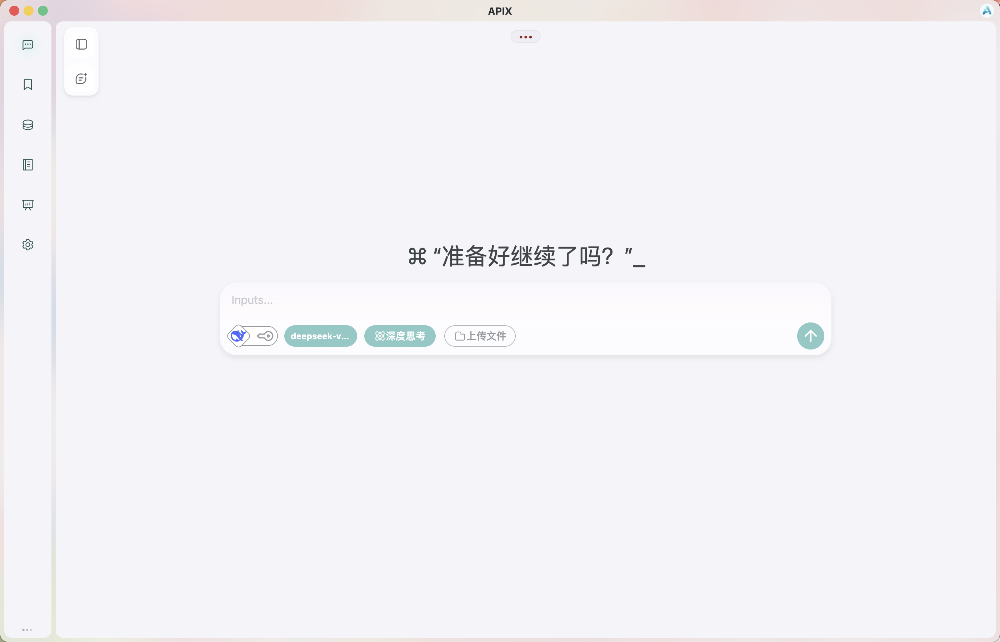

# 🚀 APIX - A full-stack AI agent platform

> A modern, modular AI agent system with extensible architecture and full-stack integration.

*Version 2.0.0*

---

## ✨ Overview

**APIX** is a full-stack AI agent platform designed for building intelligent, scalable, and extensible applications.

It integrates:

* 🧠 Multi-agent runtime system
* 💾 Memory management (short-term & long-term)
* 🔧 Tool calling framework
* 📁 File service support
* 🔐 Authentication system
* ⚙️ Task orchestration pipeline
* 🖥️ Desktop client (Electron + Vue)

The project is built with a modular architecture, making it easy to customize, extend, and deploy in different scenarios.



---

## 📦 Project Structure

```
APIX/
├── AGENT/                 # AI agent runtime
├── MEMORY/                # Memory system (Redis + MySQL)
├── TOOLS/                 # Tool calling modules
├── TASK/                  # Task orchestration
├── FILE/                  # File service
├── LOGIN_REGISTER/        # Auth system
├── CLIENT/                # Electron frontend
└── README/                # Setup & documentation
```

---

## 🚀 One-click Setup

For windows:

```bash
Set-ExecutionPolicy Bypass -Scope Process -Force
.\setup.ps1
```

For macos or linux:

```bash
chmod +x setup.sh
./setup.sh
```

## 😎 Manual setup

Please refer to the detailed setup guides:

* [中文文档](./README/README_zh.md): `./README/README_zh.md`
* [English Docs](./README/README_en.md): `./README/README_en.md`

## 🥳 Start

> Use python3 if you are macos or linux

```bash
# Start backend server 
python apix.py up

# Stop backend server
python apix.py down

# View logs
python apix.py logs

# Start front
cd ./CLIENT/apix-app
npm run dev
```

---

## 🌟 Features

* Modular multi-agent system
* Streaming response support
* Persistent memory (short-term & long-term)
* Tool invocation & extensibility
* Task-based workflow execution
* Cross-platform desktop client
* Docker-based deployment support

---

## 🛠️ Tech Stack

* **Backend**: Python 3.12, FastAPI
* **Frontend**: Electron, Vue 3, Vite
* **Database**: MySQL, Redis
* **Vector DB (Optional)**: Milvus
* **LLM Runtime (Optional)**: Ollama

---

## 📌 Notes

* This project is under active development
* Contributions, issues, and discussions are welcome

---

## 📄 License

MIT License

---

## 💡 Vision

APIX aims to provide a flexible foundation for building next-generation AI applications, combining agent-based intelligence with robust engineering practices.

---

| Broken Feature | Estimated Fix Version |
|----------------|------------------------|
| Async tools service | v2.3 |

---

⭐ If you find this project useful, feel free to give it a star!
