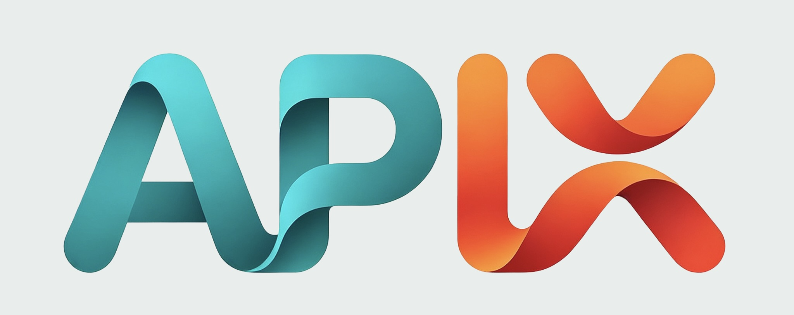

# APIX — NEXT 3.0

中文文档 | [English](./README_en.md)

**全自研的 Agent 运行时与 SDK。**

---

## 🎯 这是什么？

APIX 是一个可拓展的**全栈的 AI Agent 协作平台**。它是一套完整的 Agent 底座与运行时——支持多智能体并行协作、沙箱代码执行、知识库检索以及高自由度的插件系统。

## 🌟 有什么新内容？

- 相比于 APIX 2.x，APIX NEXT提供了全自研的Agent底座。
- 抽象存储层，可以自定义选择 redis/内存 作为缓存，MySQL/Sqlite作为持久化数据层。
- 更简化的部署流程，使用 内存 + Sqlite 即可实现pip一键安装。
- CLI Agent支持，无需使用 Electron 客户端，即可完成你的工作。
- 自研 Agent 底座，更小的外部依赖以及更可控的版本迭代。
- 自由的插件拓展点，你可以在 Agent 运行时的任何节点，自由的订阅事件以实现各种高自由度的插件，全凭你的想象！
- **APIX NEXT预计加入分布式Agent集群，敬请期待！！！**

---

## ✨ 核心特性

<table border="1" cellpadding="8" cellspacing="0" style="border-collapse: collapse; width: 100%;">
  <tr>
    <td align="center" width="33%">🤖 <b>多智能体协作</b> Leader 调度多个子代理并行工作，复杂任务自动分解，实现Agent文件访问冲突检测</td>
    <td align="center" width="33%">🔧 <b>完整工具生态</b> 代码执行、文件管理、网络搜索、知识检索开箱即用</td>
    <td align="center" width="33%">🧠 <b>完善的记忆系统</b> 以工作区划分记忆容器，人为可控的多级自动上下文压缩机制</td>
  </tr>
  <tr>
    <td align="center">🐳 <b>代码安全沙箱</b> Docker/UserNS 隔离执行，不用担心代码命令破坏系统</td>
    <td align="center">🔌 <b>多模型供应商兼容</b> OpenAI / DeepSeek / MoonShot / Ollama / XiaomiMimo / 自定义供应商任意切换</td>
    <td align="center">🎨 <b>支持自定义任务流</b> 卡片化任务流编辑，定制属于你的自动化任务流</td>
  </tr>
  <tr>
    <td align="center">👤 <b>角色卡支持</b> 自定义你的助手身份，定制一个独属于你的个人助理</td>
    <td align="center">⚒️ <b>多协议MCP兼容</b> 支持多种协议的MCP服务，并且可以自定义你的会话生命周期</td>
    <td align="center">💬 <b>消息节点化管理</b> 你可以在任意位置编辑或者删除你已发送的信息，并自动生成新的分支</td>
  </tr>
</table>

---

## 📄 许可证

本项目基于 **GNU GPL v3.0** 协议开源。

---

__🏘️ 加入社区__

[QQ群](https://qun.qq.com/universal-share/share?ac=1&authKey=ommoQrT2zhzHU%2FUxv8pfGCJbNifW%2BJyUAFBkNdzkHTPUxdxCnlgxm5aNgGslTmdE&busi_data=eyJncm91cENvZGUiOiI2Mzk0NTkxNzIiLCJ0b2tlbiI6Im9ZZkdNUWZnSVV1Y2REeUhKNnlTbWEwc05Bb093djRzUXdXNE55dklBVnlBQk9XbGNpS0ZXSDlzK3orSW1sQ3YiLCJ1aW4iOiIzMTI5NDI0NTcyIn0%3D&data=OGTchcr80RAQg8Z8_GZTdvBb7kZDeM9B3hHcNqLaAX2ZK_KYq260C4CubblEBT1bK5fP6zgtnCk2D8fIoph1ZQ&svctype=4&tempid=h5_group_info) | [Discord](https://discord.gg/tUCQthwK5)

> ⭐️ 如果你喜欢我们的项目，欢迎你的Star!