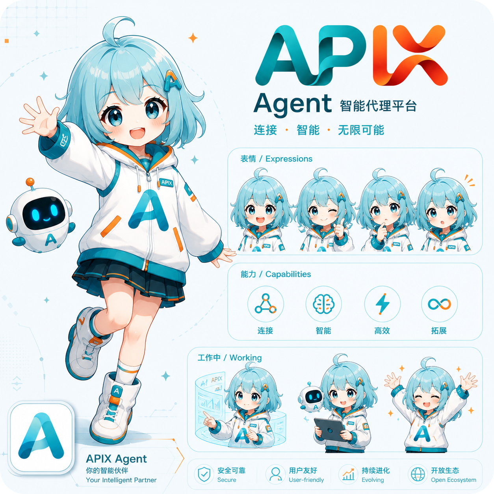

# APIX — NEXT 3.0

中文文档 | [English](./README_en.md)

**全自研的 Agent 运行时与 SDK。**

---

## 🎯 这是什么？

APIX 是一个可拓展的**全栈的 AI Agent 协作平台**。它是一套完整的 Agent 底座与运行时——支持多智能体并行协作、沙箱代码执行、知识库检索以及高自由度的插件系统。

## 🌟 有什么新内容？

- [x] 相比于 APIX 2.x，APIX NEXT提供了全自研的Agent底座。
- [x] 抽象存储层，可以自定义选择 redis/内存 作为缓存，MySQL/Sqlite作为持久化数据层。
- [ ] 更简化的部署流程，使用 内存 + Sqlite 即可实现pip一键安装。
- [ ] CLI Agent支持，无需使用 Electron 客户端，即可完成你的工作。
- [x] 自研 Agent 底座，更小的外部依赖以及更可控的版本迭代。
- [x] 自由的插件拓展点，你可以在 Agent 运行时的任何节点，自由的订阅事件以实现各种高自由度的插件，全凭你的想象！
- [ ] **APIX NEXT预计加入分布式Agent集群，敬请期待！！！**

- 在APIX 3.0中，向量库与向量检索工具不再作为内置模块提供，而通过插件的形式引入。
- 沙箱预计沿用2.x的docker沙箱机制，但不再作为强制依赖。

## 📚 使用文档

- [总览](./docs/README.md)
- [APIX Core Runtime](./docs/core/README.md)
- [事件系统](./docs/core/event/README.md)
- [Graph Runtime](./docs/core/graph/README.md)

---

## 📄 许可证

本项目基于 **GNU GPL v3.0** 协议开源。

---

__🏘️ 加入社区__

[QQ群](https://qun.qq.com/universal-share/share?ac=1&authKey=ommoQrT2zhzHU%2FUxv8pfGCJbNifW%2BJyUAFBkNdzkHTPUxdxCnlgxm5aNgGslTmdE&busi_data=eyJncm91cENvZGUiOiI2Mzk0NTkxNzIiLCJ0b2tlbiI6Im9ZZkdNUWZnSVV1Y2REeUhKNnlTbWEwc05Bb093djRzUXdXNE55dklBVnlBQk9XbGNpS0ZXSDlzK3orSW1sQ3YiLCJ1aW4iOiIzMTI5NDI0NTcyIn0%3D&data=OGTchcr80RAQg8Z8_GZTdvBb7kZDeM9B3hHcNqLaAX2ZK_KYq260C4CubblEBT1bK5fP6zgtnCk2D8fIoph1ZQ&svctype=4&tempid=h5_group_info) | [Discord](https://discord.gg/tUCQthwK5)

> ⭐️ 如果你喜欢我们的项目，欢迎你的Star!
